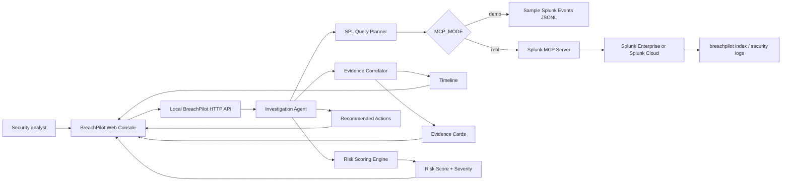

# BreachPilot Architecture Diagram

## Data flow

1. The analyst enters a user, IP address, or host in the BreachPilot console.
2. The agent decomposes the request into a sequence of scoped SPL queries.
3. In real mode, BreachPilot calls Splunk MCP Server tool `splunk_run_query` for each query.
4. Splunk MCP Server executes the searches against Splunk data and returns rows to the agent.
5. The agent correlates authentication, VPN, app, endpoint, DNS, proxy, and application evidence.
6. The dashboard displays an analyst-ready incident brief with transparent SPL queries.

## AI / agent integration

BreachPilot is intentionally agentic rather than chat-only. It performs a repeatable workflow: plan investigation steps, call Splunk MCP tools, correlate evidence, score risk signals, and generate human-in-the-loop response actions.
